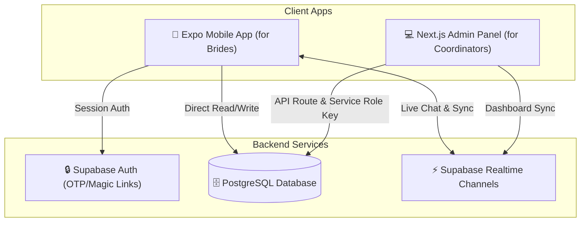

# 🌸 BrideGuide — Premium Wedding Planner & Coordinator Platform

BrideGuide is a dual-app platform designed to make wedding planning stress-free, beautiful, and collaborative. It consists of a **React Native (Expo) Mobile Application** for brides-to-be and a **Next.js Admin Dashboard** for wedding coordinators and planners.

---

## 🏗️ Platform Architecture



---

## ✨ Features

### 📱 1. Mobile App (For Brides)
- **OTP Passwordless Authentication**: Instant, secure sign-in via email validation codes.
- **Interactive Task Checklist**: Track wedding tasks with priority levels (Low, Medium, High).
- **Wedding Countdown & Calendar**: Beautiful visual countdown and task due-date marking on an interactive calendar.
- **Live Community Lounge**: Real-time group chat for brides to share recommendations and connect.
- **Profile Registry**: Customize wedding date, theme, and guest count.

### 💻 2. Admin Dashboard (For Coordinators)
- **Realtime Bride Tracker**: Monitor each bride's task completion progress in real-time.
- **Bulk Task Assignment**: Assign single tasks or bulk templates to registered brides.
- **AI Wedding Consultant**: Automatically generate and assign curated task lists based on wedding theme (Beach, Rustic, Modern, Traditional) and guest count.
- **Live Lounge Monitor**: Read and follow the live community lounge conversation feed as it happens.

---

## 📂 Directory Structure

```text
BrideGuide-1/
├── apps/
│   ├── admin/          # Next.js 16 Admin Dashboard (React, Tailwind CSS, Lucide Icons)
│   └── mobile/         # React Native Expo Mobile App (TypeScript, React Navigation, React Native Calendars)
└── supabase/
    └── schema.sql      # Database schema, triggers, and RLS policies script
```

---

## 🚀 Setup & Installation

### Step 1: Database Setup (Supabase)

1. Create a free project at [Supabase](https://supabase.com).
2. Go to your Supabase project's **SQL Editor** in the dashboard.
3. Open the file [supabase/schema.sql](file:///c:/Users/hp/Desktop/BrideGuide-1/supabase/schema.sql) in this repository, copy its contents, paste them into the SQL Editor, and click **Run**.
   - *This will set up all tables (`profiles`, `tasks`, `community_messages`), enable Row Level Security (RLS), configure database triggers for auto-profile creation, and enable real-time replication.*
4. Go to **Project Settings** -> **Authentication** in Supabase and ensure that email confirmation/registration is configured correctly (e.g. OTP sign-in).

---

### Step 2: Environment Variables Configuration

#### 💻 Admin Dashboard Setup
1. Navigate to the admin folder:
   ```bash
   cd apps/admin
   ```
2. Copy the environment template:
   ```bash
   cp .env.example .env.local
   ```
3. Open `.env.local` and paste your Supabase credentials:
   - `NEXT_PUBLIC_SUPABASE_URL` (Found in Supabase settings -> API)
   - `NEXT_PUBLIC_SUPABASE_ANON_KEY` (Found in Supabase settings -> API)
   - `SUPABASE_SERVICE_ROLE_KEY` (Found in Supabase settings -> API -> `service_role` key. Keep this secure!)

#### 📱 Mobile App Setup
1. Navigate to the mobile folder:
   ```bash
   cd ../mobile
   ```
2. Copy the environment template:
   ```bash
   cp .env.example .env
   ```
3. Open `.env` and fill in your Supabase credentials:
   - `EXPO_PUBLIC_SUPABASE_URL`
   - `EXPO_PUBLIC_SUPABASE_ANON_KEY`

---

### Step 3: Run the Applications

#### 💻 Running the Admin Dashboard
1. Install dependencies and start the development server:
   ```bash
   cd apps/admin
   ```
   ```bash
   npm install
   ```
   ```bash
   npm run dev
   ```
2. Open [http://localhost:3000](http://localhost:3000) in your browser.

#### 📱 Running the Mobile App
1. Install dependencies:
   ```bash
   cd apps/mobile
   ```
   ```bash
   npm install
   ```
2. Start the Expo development server:
   ```bash
   npm run start
   ```
3. Use the Expo Go app on your iOS/Android device to scan the QR code, or press `w` to run it in your web browser.

---

## 🔒 Security Best Practices
- **Never** commit `.env` or `.env.local` files to public repositories.
- Keep the `SUPABASE_SERVICE_ROLE_KEY` secret. It bypasses database security rules and should only be used server-side inside `apps/admin/src/app/api`.
- Client-side operations in the mobile app strictly respect Row Level Security (RLS) policies, ensuring users can only read and write their own data.
